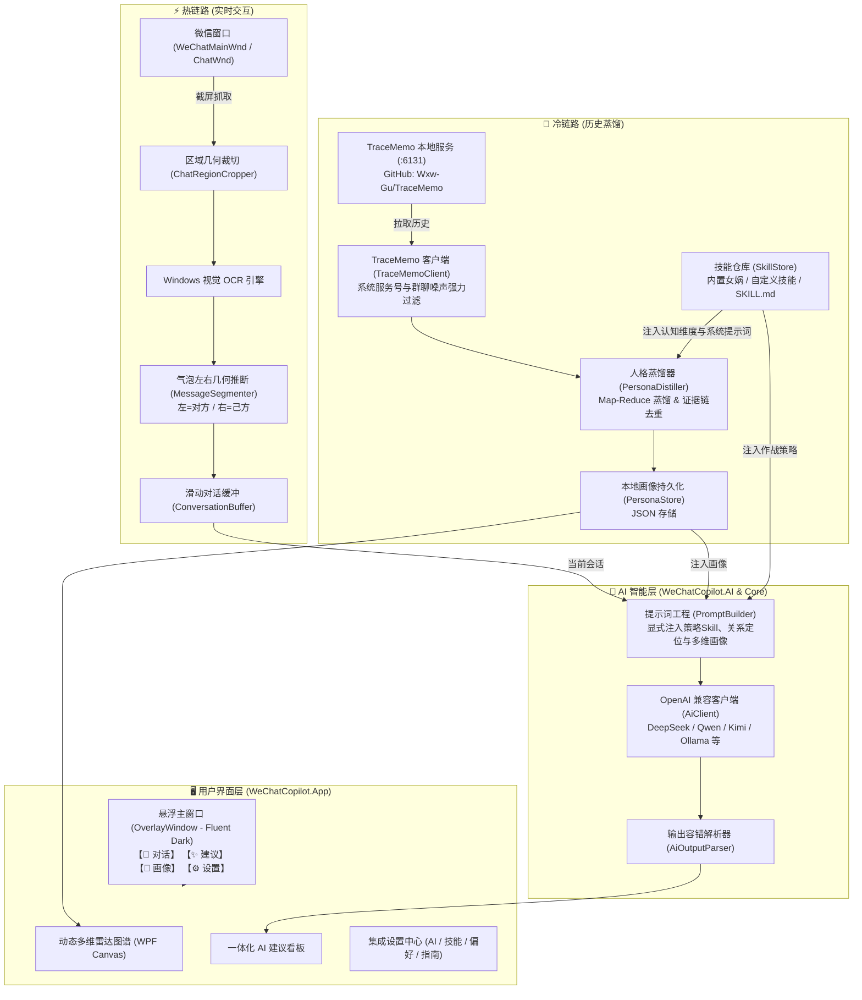

# WeChat Copilot · 微信智能聊天副驾

<div align="center">


**为微信 PC 端量身打造的贴边悬浮式 AI 聊天副驾**  
无感贴边跟随 · 纯视觉零侵入识别 · 可扩展 Skill 认知心智蒸馏 · 一体化意图穿透与多风格回复建议

[核心特性](#-核心特性) • [系统架构](#-系统架构) • [快速开始](#-快速开始) • [设置与功能指南](#-设置与功能指南) • [快捷键指南](#-快捷键指南) • [项目结构](#-项目结构) • [隐私与安全](#-隐私与安全)

</div>

---

## 📖 项目简介

**WeChat Copilot** 是一款专为 Windows 平台微信 PC 端量身定制的**智能对话辅助桌面工具**。以轻量无边框的 Fluent 暗色悬浮窗形态，自动贴合微信聊天窗口边缘，随微信窗口平滑移动与跨屏漫游。

项目遵循 **“本地优先 (Local-First)”** 与 **“只读不代发”** 的严苛安全原则：
- **热链路（实时感知）**：Windows 原生硬件级视觉 OCR 与聊天气泡几何判定，不注入进程、不解密内存、不 Hook 接口，安全零风控识读当前对话；
- **冷链路（深度认知）**：对接本地 [TraceMemo](https://github.com/Wxw-Gu/TraceMemo) 离线服务，基于可插拔的 **Skill 认知蒸馏方法论**（如女娲心智模型、表达DNA、决策启发式等），生成动态自适应的多维雷达图谱与长效画像；
- **AI 一体化策略看板**：单次模型推理，深度融合对方认知画像与作战策略，同步输出**潜台词剖析、心理诉求、避坑应对策略**与**多风格高情商回复建议**。

---

## ✨ 核心特性

### 1. 📌 智能贴边吸附与平滑跟随 (Overlay & Magnet Tracking)
- **微信窗口自适应定位**：支持微信主窗口（`WeChatMainWndForPC`）与独立单聊窗口（`ChatWnd`），自动吸附贴边。
- **平滑无抖跟随**：实时感知微信窗口移动、缩放与跨多显示器拖拽，毫秒级平滑跟随；支持一键“固定/解锁”自由拖拽。
- **智能生命周期感知**：微信最小化或隐藏时自动收起，恢复激活时平滑重现。

### 2. ⚡ 热链路：纯视觉零侵入当前对话识别 (Vision OCR & Bubble Geometry)
- **零封号风险**：完全依靠屏幕截图与 Windows 原生 WinRT OCR（`Windows.Media.Ocr`）引擎识别，绝不触碰微信内部内存或数据库。
- **气泡几何推断收发**：根据聊天气泡水平坐标中线与几何位置，精准区分**对方发言（左侧）**与**自己发言（右侧）**。
- **双引擎接入**：支持纯视觉 OCR 一键抓取，同时支持直连本地 TraceMemo 毫秒级提取零乱码原文字流。

### 3. 🧠 冷链路：动态 Skill 认知蒸馏与多维雷达图谱 (Cognitive Skill & Radar)
- **TraceMemo 历史对接**：自动对接本地 [TraceMemo](https://github.com/Wxw-Gu/TraceMemo) 微信历史记录服务，智能过滤公众号（`gh_*`）、系统通知（`notifymessage`）与群聊噪声。
- **可插拔自定义 Skill 认知策略引擎**：
  - **预置「🧬 女娲心智蒸馏」**：提炼**心智模型（三重验证）、决策启发式、表达DNA、诚实边界、反模式雷区、价值锚点**等认知操作系统全景；
  - **自定义 Skill 扩展**：支持本地导入 `SKILL.md` 或手动新增自定义策略，**雷达图谱维度与分析卡片自动随新 Skill 的维度定义动态重绘与适配**。
- **高防御特质卡片**：
  - 双列物理隔离布局，超长特质名称（如 10+ 汉字）智能截断加浮动 ToolTip，彻底解决文字与可信度重叠；
  - 动态量化评分（0~100分）、专属方法论标签、严谨可信度进度条及真实原话证据链。

### 4. 💡 AI 建议一体化看板 (Unified AI Advice)
单次大模型调用，深度融合当前策略 Skill 与对方人格画像：
- **🎯 目标原话**：智能锁定对方最新发言。
- **🟣 潜台词洞察**：穿透客套与言不由衷，剖析真实内心态度。
- **🔵 真实意图剖析**：洞察对方当下的核心关切与心理诉求。
- **🟢 应对破局策略**：结合选定 Skill 给出立竿见影的应对破局方案与雷区警示。
- **💬 多风格回复卡片**：提供**高情商、直接务实、温和共情、幽默化解**等多风格回复候选，附带设计逻辑与一键快捷复制。
- **自适应防溢出提示框**：顶部 2px 极细流光循环滚动进度条，长报错/网络异常自动折行展示与滚动保护，支持一键消除。

### 5. ⚙️ 全新集成设置中心 (Settings Hub)
主界面内嵌 4 大设置专区，告别多窗口切换：
1. **🤖 AI 模型与接口**：配置 API 基础路径、模型名称、温度系数、密码级 DPAPI 密钥与连通性测试；
2. **🏷️ 技能中心 (Skills)**：查看当前生效技能，一键切换、创建自定义 Skill 或导入本地 `SKILL.md`；
3. **🎨 偏好与系统**：窗口透明度调节、OCR 放大倍率、己方微信昵称偏好、本地数据目录一键直达与缓存清理；
4. **📖 使用指南**：完整操作指引、快捷键一览、TraceMemo 官方下载与隐私安全声明。

### 6. 🛡️ 本地优先与安全防护 (Security & Privacy)
- **DPAPI 硬件级加密**：API Key 仅通过 Windows DPAPI 本地加密存储，磁盘无明文。
- **无第三方云端中转**：除直连用户配置的大模型端点外，绝无任何开发者云端遥测与数据回传。
- **前置异常契约守护**：WPF XAML 静态资源自动契约单测守护，异常穿透直达底层根本原因并支持一键打开日志目录。

---

## 🏛️ 系统架构



---

## 📂 项目结构

```text
e:\huanmai\myprod
├── src/
│   ├── WeChatCopilot.App/        # 应用程序主工程 (WPF + XAML + Fluent 主题)
│   │   ├── OverlayWindow.xaml    # 贴边悬浮窗主界面 (对话 / 建议 / 画像 / 设置 4 大 Tab)
│   │   ├── OverlayWindow.xaml.cs # 交互事件、雷达图动态绘制、自动吸附对齐逻辑
│   │   └── App.xaml / App.xaml.cs# 全局暗色主题管理、全局未捕获异常穿透拦截与日志记录
│   │
│   ├── WeChatCopilot.Core/       # 核心业务逻辑与领域模型
│   │   ├── Ai/                   # PromptBuilder、AiOutputParser (意图穿透/建议/提示词工程)
│   │   ├── Models/               # Persona、DistillSkill、UnifiedAiAdvice、PersonaTrait
│   │   ├── Processing/           # 气泡切分 MessageSegmenter、文本规整 OcrTextJoiner
│   │   └── Services/             # PersonaDistiller (多维心智画像提炼与证据链去重)
│   │
│   ├── WeChatCopilot.AI/         # 大模型通信层 (OpenAI 协议兼容客户端)
│   │   └── AiClient.cs           # 支持超时控制、健康探测、流式与非流式调用
│   │
│   ├── WeChatCopilot.Ocr/        # 屏幕图像处理与视觉识别
│   │   ├── WindowsMediaOcrEngine.cs # Windows 原生 WinRT OCR 加速
│   │   ├── ScreenCapture.cs      # 高 DPI 感知的自适应截图
│   │   └── ChatRegionCropper.cs  # 聊天消息区域自适应裁剪
│   │
│   ├── WeChatCopilot.Windows/    # Windows 底层交互与 Win32 Interop
│   │   ├── WindowLocator.cs      # 微信主窗口与独立单聊窗口探测
│   │   ├── WindowTracker.cs      # 窗口移动/尺寸变化实时监听追踪
│   │   └── HotkeyManager.cs      # 全局快捷键注册与消息泵路由
│   │
│   └── WeChatCopilot.Data/       # 数据持久化与外部适配层
│       ├── SkillStore.cs         # 策略技能本地存储与 Markdown 导入解析
│       ├── TraceMemoClient.cs    # TraceMemo 本地 API 客户端与系统号过滤
│       ├── PersonaStore.cs       # 联系人画像本地存储与管理
│       └── DpapiProtector.cs     # Windows DPAPI 本地敏感数据加解密
│
├── tests/
│   └── WeChatCopilot.Tests/      # xUnit 自动化测试工程 (139 项测试全覆盖)
│       ├── PersonaDistillerTests.cs      # 画像蒸馏算法、证据过滤与可信度测试
│       ├── OverlayWindowXamlResourceTests.cs # XAML 静态资源契约自动防御测试
│       ├── PromptBuilderTests.cs         # 提示词工程与策略装配测试
│       └── AiOutputParserTests.cs        # AI 输出容错解析测试
│
├── WeChatCopilot.slnx            # 现代化 .NET 解决方案配置
└── README.md                     # 项目说明文档
```

---

## 🚀 快速开始

### 1. 环境准备
- **操作系统**：Windows 10 (Build 19041+) / Windows 11 x64
- **开发与运行环境**：[.NET 10 SDK (LTS)](https://dotnet.microsoft.com/download/dotnet/10.0)
- **微信桌面端**：微信 Windows PC 端 3.x 或 4.x
- **大模型 API**：支持任意 OpenAI 兼容端点（如 DeepSeek、通义千问、Kimi、Moonshot、Ollama、vLLM 等）
- **TraceMemo 服务（推荐）**：前往 GitHub 下载并启动 [TraceMemo](https://github.com/Wxw-Gu/TraceMemo)，用于微信长历史记录的本地零侵入获取。

### 2. 编译与测试

```bash
# 1. 克隆代码仓库
git clone git@github.com:jiang225638/wechat-assistant.git
cd wechat-assistant

# 2. 运行自动化测试 (139 项测试全绿)
dotnet test

# 3. 编译主程序 (Release)
dotnet build WeChatCopilot.slnx -c Release
```

### 3. 启动应用

```bash
# 直接启动应用
dotnet run --project src/WeChatCopilot.App
```

启动后，悬浮窗将自动搜索并贴合吸附在微信聊天窗口的右侧。

---

## ⚙️ 设置与功能指南

### 1. AI 接口与模型配置
在【设置】->【🤖 AI 模型与接口】中配置：

| 配置项 | 示例值 | 说明 |
|---|---|---|
| **接口基址** | `https://api.deepseek.com/v1` | OpenAI 兼容接口基础 URL（需带 `/v1`） |
| **模型名** | `deepseek-chat` | 推荐使用推理或通用对话大模型 |
| **温度系数** | `0.4` | 推荐 0.3~0.7，值越低逻辑越收敛，值越高回复越丰富多样 |
| **API Key** | `sk-xxxxxxxxxxxxxxxx` | 仅在本地通过 Windows DPAPI 加密保存，绝不落盘明文 |
| **TraceMemo 基址** | `http://127.0.0.1:6131` | 本地 TraceMemo 服务监听地址（默认端口 6131） |

> 💡 **连通性探测**：配置完毕后点击【⚡ 测试 AI 连接】，系统将发送轻量握手请求，并实时回显连通状态与往返延迟（ms）。

### 2. 技能中心 (Skill Engine)
在【设置】->【🏷️ 技能中心】中：
- **查看与切换**：随时切换全局生效的认知策略技能（如内置「🧬 女娲心智蒸馏」）；
- **自定义技能**：点击【➕ 新建自定义技能】，填写技能名称、专属图标、核心提示词以及关注维度（逗号分隔）；
- **导入外部技能**：点击【📥 导入 SKILL.md 文件】，一键将标准的 Agent Skill 规范文件解析转换为本地策略。

### 3. 数据与偏好管理
在【设置】->【🎨 偏好与系统设置】中：
- **悬浮窗透明度**：支持调节 60%~100% 窗口透明度；
- **OCR 采样放大倍率**：高分屏或小字体推荐设为 2x / 3x 以提升文字识别准确率；
- **己方微信昵称**：配置本人的微信昵称，确保历史对话中发言方精准识别与证据去重；
- **数据目录**：点击【📁 打开数据文件夹】，一键打开 `%APPDATA%\WeChatCopilot\`，便捷查看配置文件与异常日志；
- **缓存重置**：支持一键清空当前气泡识别缓存。

---

## ⌨️ 快捷键指南

| 快捷键 | 功能 | 说明 |
|---|---|---|
| <kbd>Alt</kbd> + <kbd>W</kbd> | **显示 / 隐藏悬浮窗** | 全局切换助手面板可见性 |
| <kbd>Alt</kbd> + <kbd>E</kbd> | **重新吸附微信** | 强制重新检索微信窗口并调整对其位置 |
| <kbd>Alt</kbd> + <kbd>D</kbd> | **读取当前对话** | 立即截图并执行视觉 OCR 读取最新消息 |
| <kbd>Alt</kbd> + <kbd>O</kbd> | **整窗 OCR 原文识别** | 截取完整聊天区域并展示所有文本原始识别流 |

*注：亦可通过悬浮窗顶部标题栏拖拽移动；点击【📌 吸附中/已固定】可切换自由摆放模式。*

---

## 🔒 隐私、安全与日志

- **绝无云端中转**：本项目完全开源，不设任何自建中转服务器，所有 AI 调用直接发送至用户配置的端点。
- **免杀与账号安全**：采用无侵入的屏幕图像处理技术与 TraceMemo 离线服务，**不注入 DLL、不 Hook 内存、不修改微信文件**，彻底杜绝封号隐患。
- **凭据硬件隔离**：API Key 经 Windows DPAPI（绑定当前 Windows 登录账户密钥派生）强加密存储，配置文件移至其他设备均无法解密。
- **全局异常拦截与日志**：
  - 运行期未捕获异常自动写入 `%APPDATA%\WeChatCopilot\crash.log`；
  - 遇到未知错误时自动穿透并提取底层原因，并提供弹窗一键直达日志文件夹。

---

## 🧪 自动化测试

项目内置完善的自动化测试矩阵，覆盖提示词工程、算法去重、大模型响应容错解析、XAML 静态资源契约防御与 DPAPI 加密：

```bash
dotnet test
```

测试覆盖概览（139 项全通过）：
- `OverlayWindowXamlResourceTests`：**XAML 静态资源契约自动巡检**，防御编译漏检与运行时资源丢失；
- `PersonaDistillerTests`：女娲心智蒸馏、自定义 Skill 动态装配、事实证据链过滤、可信度解析与 Map-Reduce 去重；
- `AiOutputParserTests`：一体化 AI 建议多风格容错解析、潜台词与真实意图提取；
- `PromptBuilderTests`：上下文拼接、发言者角色标注、认知画像与作战策略装配；
- `TraceMemoClientTests`：系统号过滤（`notifymessage`/`gh_*`等）、端点探测与数据安全适配；
- `MessageSegmenterTests` & `ChatRegionCropperTests`：左右气泡几何计算与区域剪裁；
- `DpapiProtectorTests`：本地数据加解密与用户隔离验证。

---

## 📄 开源许可证

本项目采用 [MIT License](LICENSE) 开源许可证。

---

## ⚠️ 免责声明

1. 本软件仅供技术交流、学习及个人日常沟通辅助使用。
2. 本软件遵守微信官方相关使用规范，不提供任何自动回复、消息群发、机器人代发等可能破坏生态平衡的功能。
3. 用户因自行配置的大模型所产生的内容合规性与使用责任由用户自行承担。
