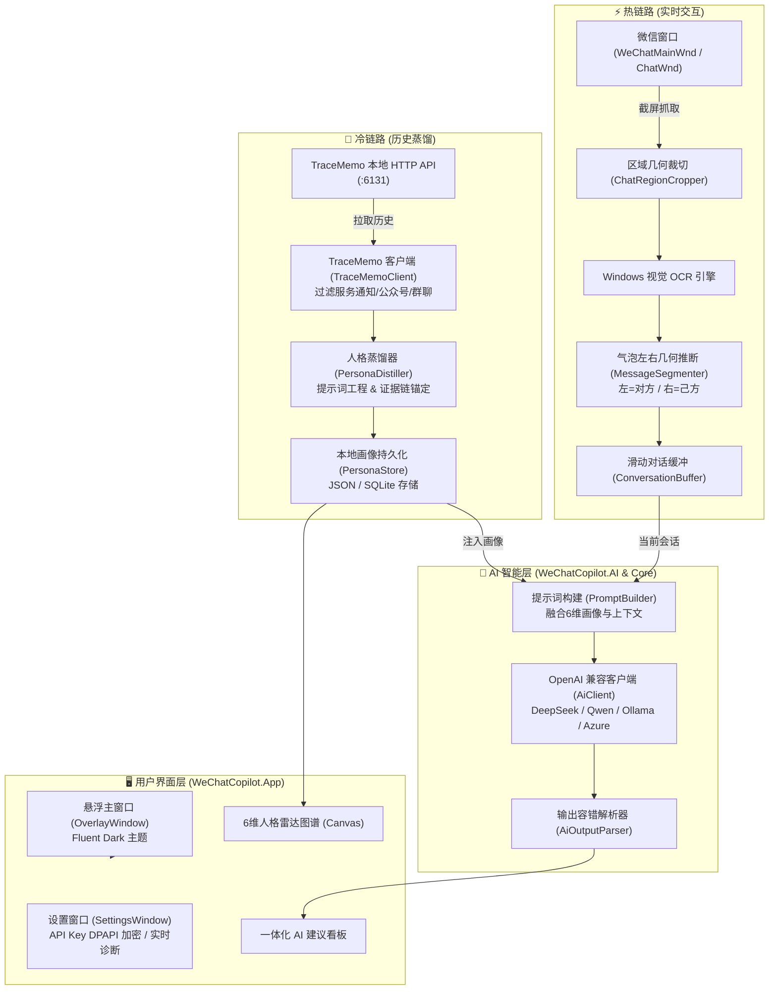

# WeChat Copilot · 微信智能聊天副驾

<div align="center">


**为微信 PC 端量身打造的贴边悬浮式 AI 聊天副驾**  
无感贴边跟随 · 纯视觉零侵入识别 · 深度冷链路人格画像蒸馏 · 一体化意图穿透与多风格回复建议

[核心特性](#-核心特性) • [系统架构](#-系统架构) • [快速开始](#-快速开始) • [快捷键指南](#-快捷键指南) • [项目结构](#-项目结构) • [隐私与安全](#-隐私与安全)

</div>

---

## 📖 项目简介

**WeChat Copilot** 是一款专为 Windows 平台微信 PC 端打造的**智能对话辅助桌面工具**。它以轻量无边框的 Fluent 暗色悬浮窗形态，自动贴合微信聊天窗口边缘，随微信窗口平滑移动与多屏漫游。

项目遵循 **“本地优先 (Local-First)”** 与 **“只读不代发”** 的设计原则：
- **热链路（实时感知）**：采用 Windows 原生视觉 OCR 与聊天气泡几何判定，不注入进程、不解密内存、不 Hook 接口，实现对当前聊天的安全读取与上下文提取；
- **冷链路（深度认知）**：集成本地 [TraceMemo](https://tracememo.com) 离线数据服务，对单聊好友历史进行深度人格蒸馏，生成涵盖 6 大维度的量化人格画像与雷达图谱；
- **AI 一体化看板**：单次模型调用，深度融合对方人格特征，同时输出**潜台词剖析、心理诉求、避坑应对策略**与**多风格高情商回复建议**。

---

## ✨ 核心特性

### 1. 📌 智能贴边吸附与平滑跟随 (Overlay & Magnet Tracking)
- **微信窗口自适应定位**：支持微信主窗口（`WeChatMainWndForPC`）与独立单聊窗口（`ChatWnd`），自动对齐右侧边缘（支持切换左侧吸附）。
- **实时同步跟随**：支持微信拖拽移动、跨 DPI 缩放、跨多显示器拖动，悬浮窗毫秒级无抖动贴边跟随。
- **状态感知**：微信最小化或隐藏时自动隐身，微信恢复时自动重现；支持一键“固定/解锁”进行任意位置摆放。

### 2. ⚡ 热链路：纯视觉零侵入当前对话识别 (Vision OCR & Bubble Geometry)
- **零封号风险**：完全依靠屏幕截图与 Windows 原生 WinRT OCR（`Windows.Media.Ocr`）引擎识别，绝不触碰微信内存与内部数据库。
- **气泡几何推断收发**：根据聊天气泡水平坐标中线与几何位置，精准区分**对方发言（左侧）**与**自己发言（右侧）**。
- **智能去重与缓冲**：多帧截图文本切分、局部规范化去重，动态维护最近对话上下文。

### 3. 🧠 冷链路：TraceMemo 历史接入与 6 维人格蒸馏 (Persona Distillation)
- **全自动鉴权接入**：内置 TraceMemo 本地 LevelDB Token 解密探针，开箱即用对接本地历史记录。
- **精准过滤系统噪声**：智能排除微信服务通知（`notifymessage`）、公众号（`gh_*`）、群聊（`@chatroom`）与各类系统助手，精准定位真人好友。
- **6 维人格特质雷达**：基于完整历史记录提炼出：
  1. 沟通风格（严谨/直接/委婉/情绪化等）
  2. 性格心理（稳健/果断/敏感/开放等）
  3. 情感倾向（亲近度与情绪波动）
  4. 互动模式（主动性与回复节奏）
  5. 利益诉求（核心关切与推进诉求）
  6. 禁忌雷区（反感表达与沟通痛点）
- **交互式数据可视化**：基于 WPF 原生 Canvas 渲染 6 维雷达图谱，直观展示量化分值（0~100）与高置信度原话证据链。

### 4. 💡 AI 建议一体化看板 (Unified AI Advice)
告别繁琐的视图切换，单次大模型推理即可输出完整的洞察与应对策略：
- **🎯 目标原话**：智能锁定对方最新发言。
- **🟣 潜台词洞察**：穿透客套与言不由衷，揭示话外之音。
- **🔵 真实心理诉求**：洞察对方当下的核心关切与情绪状态。
- **🟢 应对破局策略**：提供立竿见影的沟通策略与避坑指南。
- **💬 多风格回复卡片**：提供**高情商、直接、专业、缓和、幽默**等多风格回复候选，附带推荐理由与一键快捷复制（带动态反馈特效）。
- **🎯 画像深度联动**：分析与建议显式融合对方已蒸馏的特质与量化分，千人千面，拒绝套话。

### 5. 🔒 本地优先与安全防护 (Security & Privacy)
- **DPAPI 本地硬件级加密**：API Key 等敏感凭证经 Windows DPAPI 加密存储于本地，磁盘无任何明文凭证。
- **无任何遥测外传**：全链路数据除直接发送给用户配置的大模型端点外，不建立任何第三方网络连接。
- **只读设计**：仅提供参考建议与剪贴板复制，坚决不代替用户自动发送消息。

---

## 🏛️ 系统架构



---

## 📂 项目结构

```text
e:\huanmai\myprod
├── src/
│   ├── WeChatCopilot.App/        # 应用程序主工程 (WPF + XAML + Fluent 主题)
│   │   ├── OverlayWindow.xaml    # 贴边悬浮窗主界面 (对话 / AI建议 / 人格画像 / 帮助)
│   │   ├── SettingsWindow.xaml   # 设置窗口 (模型、API Key、端点、一键连通性测试)
│   │   └── App.xaml              # 全局 Fluent Dark 主题管理与未捕获异常守护
│   │
│   ├── WeChatCopilot.Core/       # 核心业务逻辑与领域模型
│   │   ├── Ai/                   # PromptBuilder、AiOutputParser (一体化解析/建议生成)
│   │   ├── Models/               # Persona、UnifiedAiAdvice、ChatMessage、AiSettings
│   │   ├── Processing/           # 气泡切分 MessageSegmenter、文本规整 OcrTextJoiner
│   │   └── Services/             # PersonaDistiller (六维画像蒸馏业务)
│   │
│   ├── WeChatCopilot.AI/         # 大模型通信层 (OpenAI 协议兼容客户端)
│   │   └── AiClient.cs           # 支持流式/非流式、超时控制、诊断测试
│   │
│   ├── WeChatCopilot.Ocr/        # 屏幕图像处理与 OCR 识别
│   │   ├── WindowsMediaOcrEngine.cs # Windows.Media.Ocr 原生加速
│   │   ├── ScreenCapture.cs      # 高 DPI 感知的无缝截图
│   │   └── ChatRegionCropper.cs  # 聊天消息区域自适应裁剪
│   │
│   ├── WeChatCopilot.Windows/    # Windows 底层交互与 Win32 Interop
│   │   ├── WindowLocator.cs      # 微信主窗口与独立单聊窗口探测
│   │   ├── WindowTracker.cs      # 窗口移动/尺寸变化实时监听追踪
│   │   └── HotkeyManager.cs      # 全局快捷键注册与消息泵路由
│   │
│   └── WeChatCopilot.Data/       # 数据存储与外部适配器
│       ├── TraceMemoClient.cs    # TraceMemo 本地 API 客户端与系统号多重过滤
│       ├── TraceMemoTokenProvider.cs # LevelDB / 本地文件 Token 自动解密提取
│       ├── PersonaStore.cs       # 联系人画像本地存储
│       └── DpapiProtector.cs     # Windows DPAPI 本地数据加解密
│
├── tests/
│   └── WeChatCopilot.Tests/      # xUnit 单元测试工程 (108 项测试，全覆盖)
│
├── tools/
│   └── TmProbe/                  # TraceMemo 本地协议探针与逆向校准工具
│
├── WeChatCopilot.slnx            # 现代化 .NET 解决方案配置
└── README.md                     # 项目说明文档
```

---

## 🚀 快速开始

### 1. 环境准备
- **操作系统**：Windows 10 (19041 或更高版本) / Windows 11 x64
- **运行时 / SDK**：[.NET 10 SDK (LTS)](https://dotnet.microsoft.com/download/dotnet/10.0)
- **微信桌面端**：微信 Windows PC 端 3.x 或 4.x
- **大模型 API**：支持任意 OpenAI 兼容接口（如 DeepSeek、通义千问、Kimi、Moonshot、Ollama、vLLM 等）
- **可选依赖**：[TraceMemo](https://tracememo.com)（若需使用聊天记录生成深度人格画像，需本地运行 TraceMemo）

### 2. 编译与测试

```bash
# 1. 克隆代码仓库
git clone git@github.com:jiang225638/wechat-assistant.git
cd wechat-assistant

# 2. 还原依赖并执行单元测试 (108项测试全绿)
dotnet test

# 3. 编译主程序 (Release)
dotnet build WeChatCopilot.slnx -c Release
```

### 3. 运行体验

```bash
# 直接启动应用
dotnet run --project src/WeChatCopilot.App
```

启动后，悬浮窗将自动搜索桌面运行中的微信并贴边吸附在窗口右侧。

---

## ⚙️ 配置说明

点击悬浮窗顶部的 **⚙ 设置** 按钮，进入 AI 设置界面：

| 配置项 | 示例值 | 说明 |
|---|---|---|
| **接口基址** | `https://api.deepseek.com/v1` | OpenAI 兼容接口基础 URL（需带 `/v1`） |
| **模型名** | `deepseek-chat` | 推荐使用推理或对话大模型 |
| **温度 (0~1)** | `0.4` | 建议 0.3~0.7，值越低逻辑越确定，值越高回复越发散多样 |
| **API Key** | `sk-xxxxxxxxxxxxxxxx` | 密钥仅在本地经 Windows DPAPI 加密保存，绝不落盘明文 |
| **TraceMemo 基址** | `http://127.0.0.1:6131` | 本地 TraceMemo 监听地址（默认端口 6131） |

> 💡 **实时连通性测试**：设置界面下方提供【⚡ 测试 AI 连接】按钮，点击后将发送极简握手探测，即时显示连通状态、延迟（ms）及诊断信息。

---

## ⌨️ 快捷键指南

| 快捷键 | 功能 | 说明 |
|---|---|---|
| <kbd>Alt</kbd> + <kbd>W</kbd> | **显示 / 隐藏悬浮窗** | 全局切换助手面板可见性 |
| <kbd>Alt</kbd> + <kbd>E</kbd> | **重新吸附微信** | 强制重新检索微信窗口并调整对其位置 |
| <kbd>Alt</kbd> + <kbd>D</kbd> | **读取当前对话** | 立即截图并执行视觉 OCR 读取最新消息 |
| <kbd>Alt</kbd> + <kbd>O</kbd> | **整窗 OCR 原文识别** | 截取完整聊天区域并展示所有文本原始识别流 |

*注：亦可通过悬浮窗顶部标题栏拖拽临时移动；点击【📌 吸附中】可锁定/解锁自由拖拽。*

---

## 🔒 隐私与安全

- **绝无云端中转**：本项目不设任何自建中转服务器，所有请求均直连用户配置的大模型端点。
- **免杀与账号安全**：采用无侵入的屏幕图像处理技术，**不 Hook、不注入 DLL、不修改微信文件**，杜绝违规封号风险。
- **凭据硬件隔离**：API Key 等敏感数据均经由 Windows 系统级 DPAPI（与当前登录 Windows 账户安全绑定）加密，即使配置文件泄漏也无法在其它设备解密。

---

## 🧪 单元测试

项目内置完善的自动化测试矩阵，覆盖提示词工程、大模型响应解析、OCR 文本处理、TraceMemo 过滤与 DPAPI 加密：

```bash
dotnet test
```

测试覆盖概览：
- `AiOutputParserTests`：回复建议卡片解析、六维潜台词解析、一体化 AI 建议多风格容错解析；
- `PromptBuilderTests`：上下文拼接、发言者角色格式化、画像显式注入、多候选参数约束；
- `TraceMemoClientTests`：系统号过滤（`notifymessage`/`gh_*`等）、多端点适配、联系人解析；
- `PersonaDistillerTests`：观察层/推断层分离、量化评分归一化、事实证据链锚定；
- `MessageSegmenterTests` & `ChatRegionCropperTests`：左右气泡几何计算与区域剪裁；
- `DpapiProtectorTests`：数据加密、解密及跨上下文隔离验证。

---

## 📄 开源许可证

本项目采用 [MIT License](LICENSE) 开源许可证。

---

## ⚠️ 免责声明

1. 本软件仅供技术交流、学习及个人办公辅助使用。
2. 本软件遵守微信相关使用规范，不提供任何自动回复、消息群发、机器人代发等可能破坏生态平衡的功能。
3. 用户因自行配置的大模型所产生的内容合规性与使用责任由用户自行承担。
